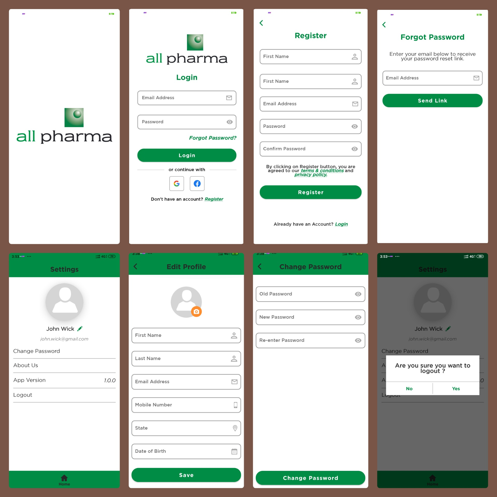

## This is a master project or a template project which we can use to speed-up the initial efforts of setting up any new project.

**Instructions to setup a new project using this master project:**

### Step 1. Setup Package Name
- Clone this project to a preferred directory.
- Open it in Android Studio.
- From the project, select the top level package name (com.app.masterproject) and hit Shift+F6. 
This will open a rename package window. Change the package name to actual app package name.
- Go to app module gradle file and rename applicationId to the package name you set in previous step.

### Step 2. Setup Keystore
- Create a new keystore file. 
Refer: https://developer.android.com/studio/publish/app-signing#generate-key
- Once keystore file is created, move the file to "keystore" folder in the project.
- Add the keystore password information to app module build gradle file in signingConfigs block.
- Update all information in "keystore/keystore_details.txt" file.

### Step 3. Setup Firebase
- Go to Firebase decided project and add a new app from Firebase console with the same package name.
- While creating the app on Firebase, you'll get google-services.json file. If the app is already crated,
you can download the file from Project Settings ->  Your Apps.
- Download it and move to the "app" folder in the project.

### Step 4. Setup Social Login
- Generate Google Login API Key and replace the key in build.gradle file
- Generate the Facebook Login Keys and replace the keys in build.gradle file
- Use release keystore to generate SHA or Key hash.

### Step 5. Setup Adaptive Launcher Icon
- We need two layers for creating the adaptive launcher icon. Foreground and Background.
- Ask designer to provide these two layers as separate image files (Minimum 500x500)
- Once you have both images, go to res->drawable. Right click on drawable folder.
- Go to New -> Image Asset.
- There you'll need to select foreground and background images. Click next, verify icons and finish.

### Step 6. Setup APIs
- Go to app module build gradle file and update the URLs mentioned under defaultConfig block.
- Verify the endpoints mentioned in APIConstants.kt file.

### Step 7: Move the project setup code to actual repository
- Once project setup is done, move all the project files to the empty repository of your project and commit.
- You'll need to open the project from that folder in Android Studio going forward.

Once these steps are done, you're ready to go ahead with design changes as per the requirement.
 